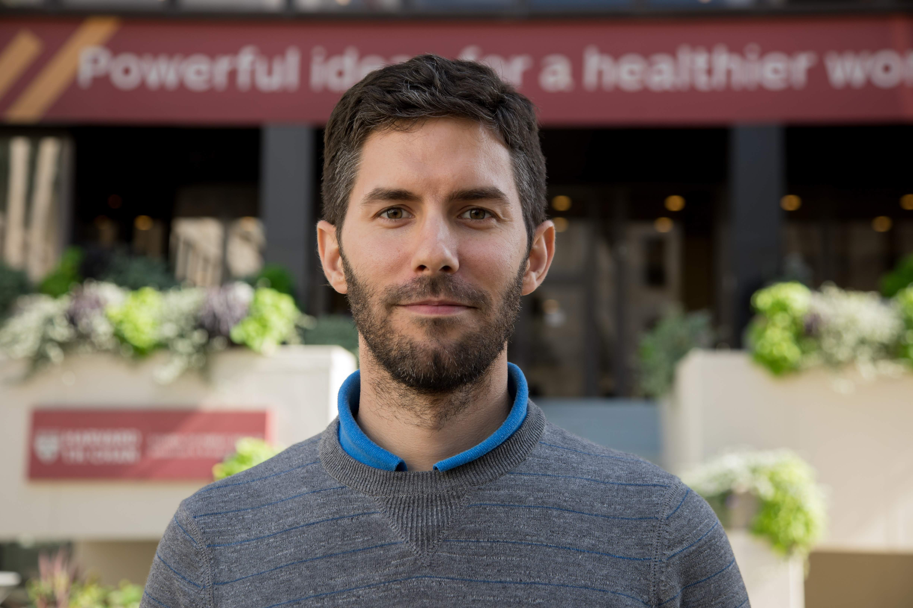
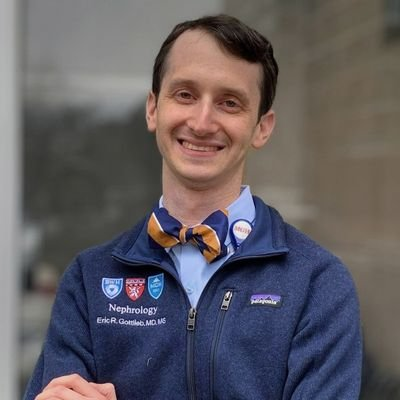

# Course Faculty Information
### Leo Celi 
 

Leo Anthony Celi has practiced medicine in three continents, giving him broad perspectives in healthcare delivery. As clinical research director and principal research scientist at the MIT Laboratory of Computational Physiology (LCP), he brings together clinicians and data scientists to support research using data routinely collected in the intensive care unit (ICU). His group built and maintains the Medical Information Mart for Intensive Care (MIMIC) database. This public-access database, which now holds clinical data from over 60,000 stays in BIDMC ICUs, has been meticulously de-identified and is freely shared online with the research community. It is an unparalleled research resource; over 4000 investigators from more than 30 countries have free access to the clinical data under a data use agreement. In 2016, LCP partnered with Philips eICU Research Institute to host the eICU database with more than 2 million ICU patients admitted across the United States. The goal is to scale the database globally with contributions from the United Kingdom, France, Spain and Brazil over the next year. Leo founded and co-directs Sana, a cross-disciplinary organization based at the Institute for Medical Engineering and Science at MIT, whose objective is to leverage information technology to improve health outcomes in low- and middle-income countries. At its core is an open-source mobile tele-health platform that allows for capture, transmission and archiving of complex medical data (e.g. images, videos, physiologic signals such as ECG, EEG and oto-acoustic emission responses), in addition to patient demographic and clinical information. Sana is the inaugural recipient of both the mHealth (Mobile Health) Alliance Award from the United Nations Foundation and the Wireless Innovation Award from the Vodafone Foundation in 2010. The software has since been implemented around the globe including India, Kenya, Lebanon, Haiti, Mongolia, Uganda, Brazil, Ethiopia, Argentina, and South Africa. He is one of the course directors for HST.936 – global health informatics to improve quality of care, and HST.953 – secondary analysis of electronic health records, both at MIT. He is an editor of the textbook for each course, both released under an open access license. The textbook “Secondary Analysis of Electronic Health Records” came out in October 2016 and was downloaded more the 100,000 times in the first ten months of publication. The course “Global Health Informatics to Improve Quality of Care” was launched under edX in February 2017. Leo was featured as a designer in the Smithsonian Museum National Design Triennial “Why Design Now?” held at the Cooper-Hewitt Museum in New York City in 2010 for his work in global health informatics. He has spoken in more than 20 countries about the value of data in improving population health.

### Maia Majumder

Dr. Maimuna (Maia) Majumder is a member of the Computational Health Informatics Program (CHIP) faculty at Harvard Medical School and Boston Children’s Hospital and a recent graduate of the Engineering Systems program at MIT’s Institute for Data, Systems, and Society (IDSS). In between her graduate studies and her current position at CHIP, Maia spent a year at the Health Policy Data Science lab at Harvard Medical School’s Health Care Policy department as a postdoctoral fellow. During her masters and doctoral studies at MIT, she was funded through a graduate fellowship at HealthMap. Prior to Maia’s arrival at MIT, she earned a Bachelors of Science in Engineering Science (with a concentration in Civil and Environmental Engineering) and a Masters of Public Health in Epidemiology and Biostatistics at Tufts University. While at Tufts, Maia was a field researcher with the International Centre for Diarrheal Disease Research, Bangladesh (ICDDR,B), where she worked with clinic patients (and their data) to learn how to better tell their stories. Her current research interests involve probabilistic modeling, artificial intelligence, and “systems epidemiology” in the context of public health, with a focus on causal inference for infectious disease surveillance using digital disease data (e.g. search trends; news and social media). She also enjoys exploring novel techniques for data procurement, writing about data for the general public, and creating meaningful data visualizations. As of January 2020, Maia has been engaged in pandemic response efforts and is a leading expert in COVID-19 epidemiology.

### Marie-Laure Charpignon

### Jay Chandra

Jay is a junior at Harvard College studying Statistics & Molecular and Cellular Biology. During his time in undergrad, Jay has been involved in many projects related to medical technology, computational neuroscience, and bioinformatics. He has extensive experience with the mortality data that will be used in HST 936 and is a co-lead on the preliminary project that was the inspiration of the course (Evaluation of County-Level Heterogeneity in Excess Mortality in Colorado)

### Mat Samuel

### Kenneth Paik

Kenneth Paik is a clinical informatician driving quality improvement and democratizing access through technology innovation, combining a multidisciplinary background in medicine, artificial intelligence, business management, and technology strategy. He is a research scientist at the MIT Laboratory for Computational Physiology investigating the secondary analysis of health data and building intelligent decision support systems.

### Umbereen Nehal

Umbereen S. Nehal, MD, MPH is a Sloan Fellow at MIT, a former Medicaid medical director, and a former Chief Medical Officer for a 14-center community health organization in NYC. Educated at Aga Khan University, Baylor College of Medicine, and Harvard School of Public Health, she has been named a “Top Voice” four times by LinkedIn. Dr. Nehal was clinical lead for $1.8b in new funding for Medicaid reform to value-based care. She was recognized by President Obama for a healthcare enrollment campaign for the White House. Dr. Nehal is published in the area of quality improvement, business models for AI in healthcare, refugee health, and medical education for patient-centered care. 

### Grace Charles

Grace Charles is a Research Scientist at Surgo Ventures. She integrates behavioral science, machine learning, and data science to generate insights that improve human well-being. As a Research Scientist, Grace supports many of Surgo’s research activities, including leading analyses, developing data collection and analytical methods, and designing interventions to transform health behaviors. She is passionate about translating scientific findings into interpretable and actionable insights and strongly believes in the power of interdisciplinary research. Prior to joining Surgo, Grace received her PhD in Ecology from University of California, Davis and an AB in Biology from Harvard University.

### Joel Park

Dr. Joel Park, MD, MS, is the Director of Medical Informatics and Health Information Systems - Applied Innovation, BeiGene, a biopharmaceutical company focused on oncological drug development and an MIT Critical Data affiliate. Dr. Park engineers and integrates different health information systems to provide high quality, curated data in preparation for research and regulatory submissions. Prior to his current role, Dr. Park was an Assistant Professor of Clinical Emergency Medicine and Population Health Sciences at Weill Cornell Medicine as well as the Clinical Lead for the NewYork-Presbyterian IT Transformation Team. Joel is also a board-certified emergency medicine physician in New York City, and in his free time, enjoys spending time in the outdoors and cycling.

### Ned McCague

Ned has been a data professional in Boston for the last decade. He has held positions at BCBSMA and Kyruus, where he has focused on data insights, informatics R&D, client analytics, financial informatics, trend measurement, and product analytics. In addition to his professional experience, he has taught classes at BU and MIT, focusing on research methodologies, global health, and data science.

### Santiago Romero-Brufau

Santiago Romero-Brufau is an M.D., Ph.D. in Clinical Informatics with an engineering background. He is currently Assistant Professor of Medicine and Healthcare Systems Engineering at Mayo Clinic, and Principal Data Scientist for their Department of Medicine. He's also affiliated with the Harvard T.H. Chan School of Public Health.
His main career interest is in the transformation of healthcare delivery to improve clinical outcomes and efficiency through the implementation of machine-learning models for clinical decision support.
His past work includes development and implementation of multiple machine-learning algorithms into Mayo's medical practice, including an early warning score, a triage tool for incoming patients, and other applied projects. His previous work has also looked into the use of social determinants of health as predictors for machine-learning models on a population basis.
More recently, in the context of COVID he has been working on the prediction of hospital census to optimize staffing, and in agent-based simulations to examine the effect of alternative vaccination strategies.

### Yugang Jia

Dr. Yugang Jia is a data science manager in Verily Life Sciences (formerly known as Google Life Sciences) , where he joined in 2020. He obtained his Ph.D. degree in Electrical and Electronic Engineering from University of Bristol, UK, in 2007. He was VP of healthcare data science at Fidelity Investments from 2017-2019 and senior scientist/innovation lead at Philips Research from 2007 to 2017. His research interests are mainly in data science/artificial intelligence and their application in digital health and clinical informatics.

### Eric Gottlieb

Eric Gottlieb is a second-year nephrology fellow at Brigham and Women's Hospital and lecturer with the Laboratory for Computational Physiology. Originally from Baltimore, MD, he studied business as an undergraduate at Emory University. He then completed a master's degree in molecular medicine and medical school at the University of Maryland. He completed his internal medicine residency at Brown University/Rhode Island Hospital.  His current research focuses on predicting and optimizing outcomes in continuous renal replacement therapy. In addition to his role in .936/.938, he precepts for the HST clinical experience at Mount Auburn Hospital.

### Sreekar Mantena

### Anushka Bhaskar

### Saketh Sundar

Saketh Sundar is a research intern at MIT Laboratory of Computational Physiology. Under the mentorship of Mr. Nicolas Della Penna and Dr. Leo Celi, he is collaborating with research scientists from MIT, Harvard, and around the world on a few projects. Recently he worked on a COVID-19 forecasting project hosted by the Center for Disease Control and Prevention, which involved forecasting the number of COVID-19 cases and deaths across counties in the United States using a large diverse set of time-varying features. He is also an active member in projects including COVID-19 excess mortality analysis and prediction of Dengue vulnerability in Colombia using satellite images. His research interests are mainly in data science/artificial intelligence and their application in public health and bioinformatics. He is a student at River Hill High School, Clarksville, MD.

